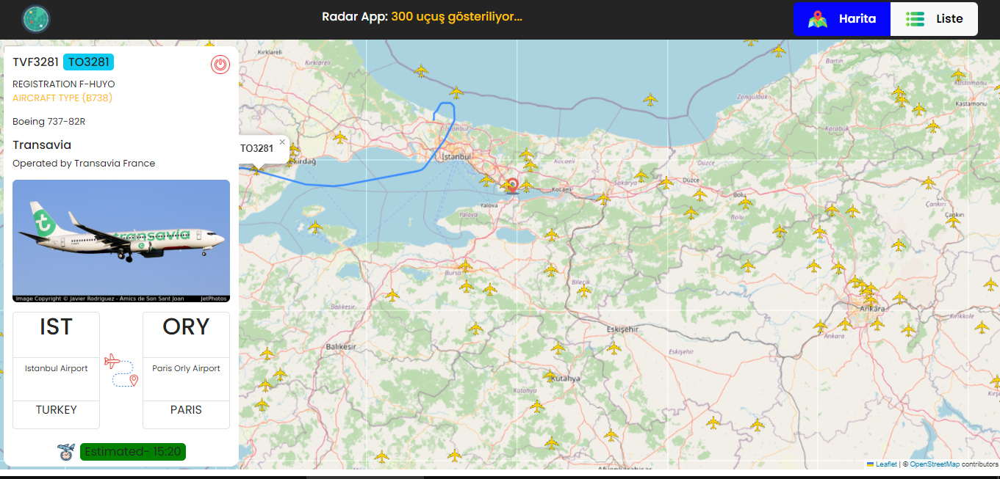

# Radar Projesi

Bu proje, Rapid API kullanarak bir radar uygulaması geliştirmek için React ve Redux Toolkit kullanılarak oluşturulmuştur.

API : 'https://flight-radar1.p.rapidapi.com/flights

Apiden alınan uçuş verileri TR koordinatları ile çerçevelndirimiş o bölgedeki 300 uçuşa erişilip ekranda icon ile gösterilmiştir.
- iconlara tıklanınca uçuş verisinin detayı gösterilmiştir.
- Bu gelen veriler list sayfasında paginate kütüphanesi ile sayfalandırılmıştır.

# Kütüphaneler
- @reduxjs/toolkit
- react-redux
- axios
- leaflet
- react-leaflet
- react-paginate

## Önizleme

# Radar-App-Redux-Toolkit
